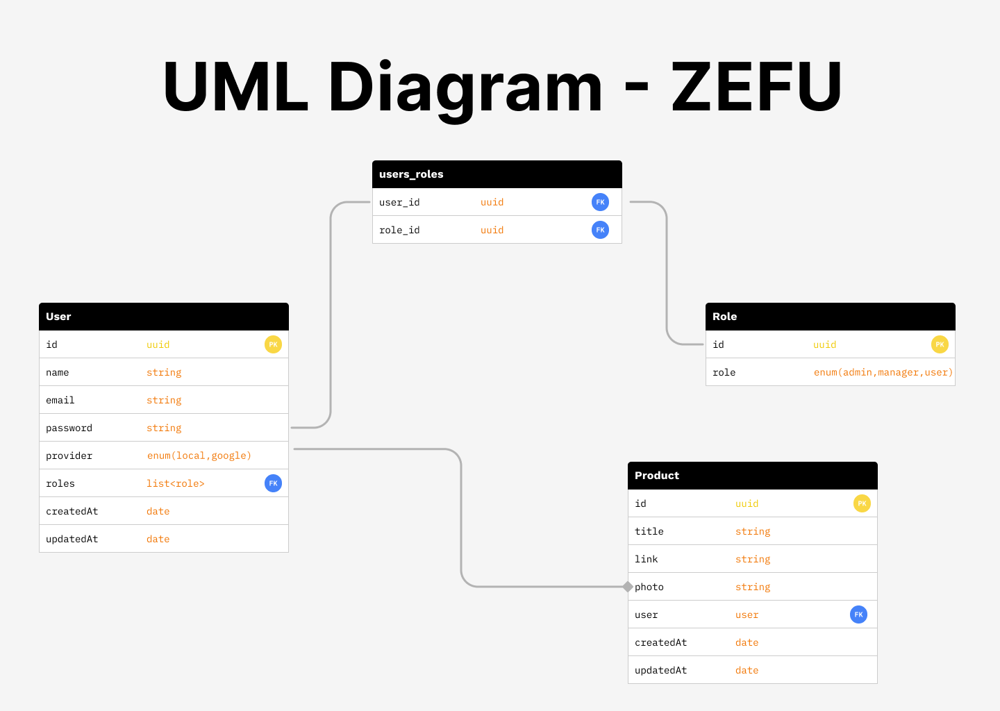

# API da aplicação ZEFU 🌎
## Desenvolvida para fornecer os recursos ao cliente

### Tecnologias
- Java
- Spring boot, security

### Recursos
- Autenticação de usuários
  - Cadastro
  - Login
  - Recuperação de senha
    
- Segurança
  - Sistema de roles (acesso à recursos com base no seu papel - administrador, gerente ou usuário)
  - Token JWT
    
- CRUD Produtos
  - Ver
  - Cadastrar
  - Editar
  - Excluir

#### Client
https://github.com/hllrdev/zefu
